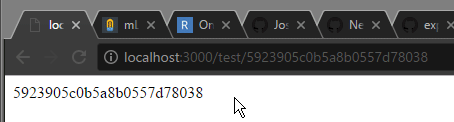

# UPDATE
### This is a symptom of reusing the same RegExp object in JS to evalute strings multiple times with the 'g' (global) flag.
This is a topic that seems to have been debated for a while and has confused quite a few individuals. (https://bugzilla.mozilla.org/show_bug.cgi?id=237111)
The behaviour is explicitly intended, however.

The original README is as follows:

# Express Regex Bug

This repository is meant to demonstrate a bug with regex matching in Express` routing.

## Symptoms

Exactly half of the time a URL is visited that matches the regex, it will route properly. The other half of the time, it will simply not resolve. The first time one of these URLs is visited, the URL will route properly. The second time, it will not. The pattern then repeats.

## Demonstration

```
node index.js
```

The server runs on port 3000 by default, and will print some example URLs in console.

Here is a GIF demonstrating the outcome:



## Regex

The regex tested is as follows:

```
/\/test\/[a-f0-9]{24}/g
```

## Additional Info

The output of
```
/\/test\/[a-f0-9]{24}/g.test("/test/b60873051996f8378607fa34")
```
will always return true.

## Testing Configurations

### Config 1

- Windows 10 v1703 Build 15063.296
- NodeJS v7.10.0
- Express v4.15.3

### Config 2

- Manjaro i3 17.0.1
- NodeJS v7.10.0
- Express v4.15.3
